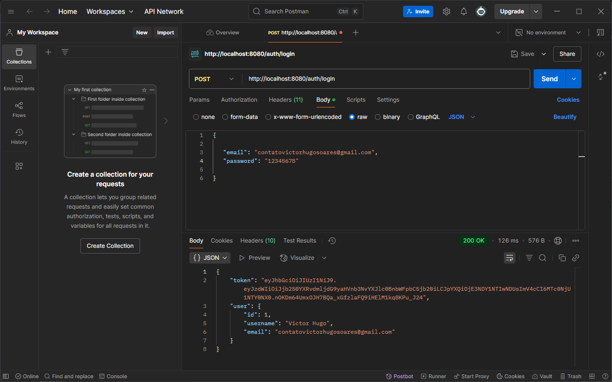
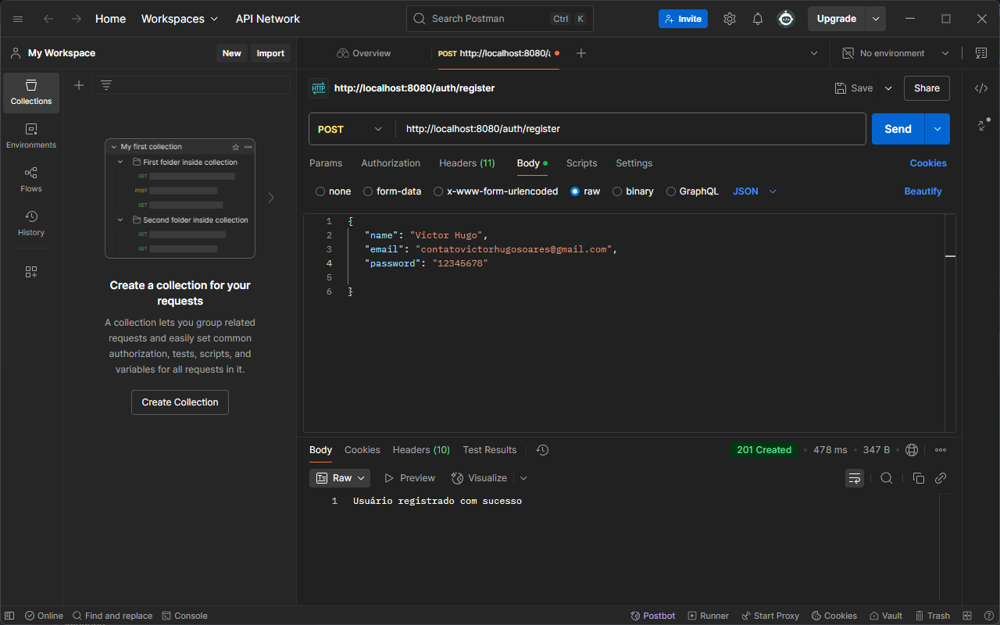
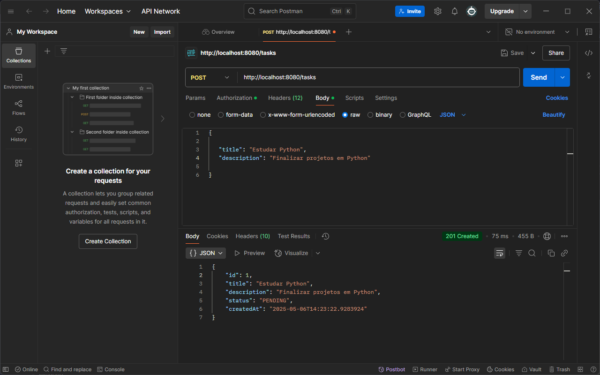
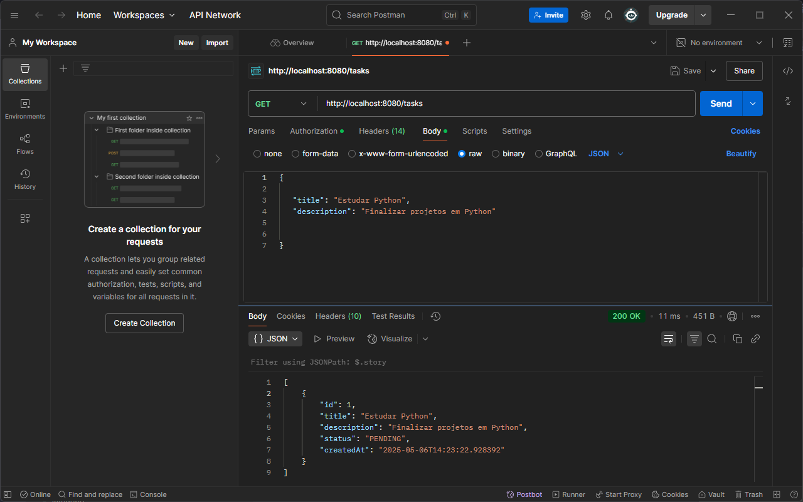
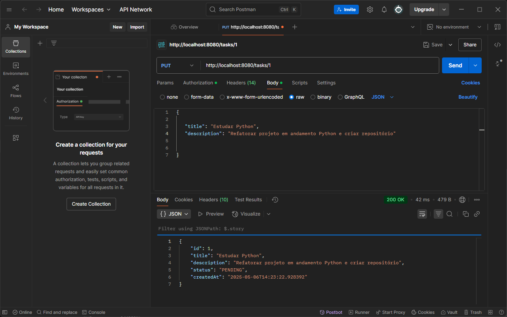
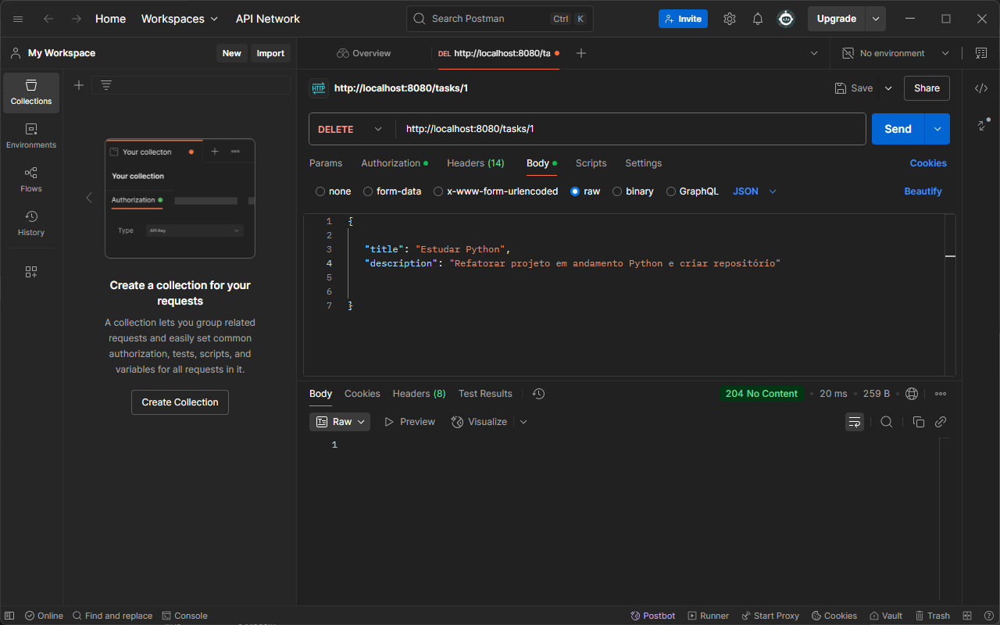
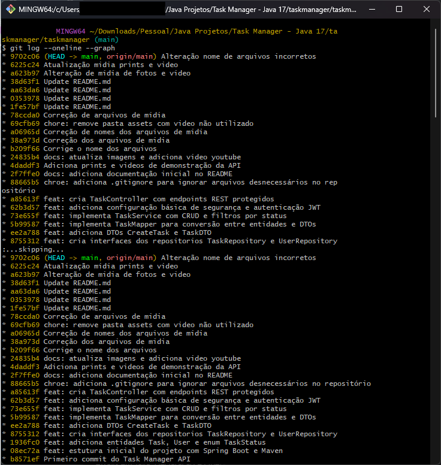

# 📌 Task Manager API

Uma API RESTful desenvolvida com **Spring Boot** para gerenciamento de tarefas com autenticação JWT e cadastro de usuários.

---

## 📚 Funcionalidades

- Registro de novos usuários
- Login com autenticação via JWT
- Criação de tarefas
- Listagem de tarefas por usuário (com filtro por status)
- Atualização e remoção de tarefas
- Proteção de rotas com autenticação

---

## 🚀 Tecnologias utilizadas

- Java 17
- Spring Boot
- Spring Security (JWT)
- Hibernate / JPA
- H2 Database
- Lombok
- Maven

---

## 💻 Como rodar localmente

1. Clone o repositório:

git clone https://github.com/okvictorhugo/task-manager-api.git

    Abra o projeto em sua IDE Java (Eclipse, IntelliJ, VS Code).

    Rode o projeto com o Spring Boot (TaskManagerApplication).

    O banco de dados H2 será inicializado automaticamente com as configurações do application.properties.

    Use o Postman ou outra ferramenta para consumir os endpoints.

🔄 Como usar a API com Postman

Abaixo está o passo a passo para utilizar a API de gerenciamento de tarefas:
1. ## 📌 Registro de usuário

    Endpoint: POST /auth/register

    Body (JSON):

{
  "name": "Seu Nome",
  "email": "seu@email.com",
  "password": "123456"
}

2. ## 🔑 Login

    Endpoint: POST /auth/login

    Body (JSON):

{
  "email": "seu@email.com",
  "password": "123456"
}

    ✅ Você receberá um token JWT.

3. ## 📝 Criar nova tarefa

    Endpoint: POST /tasks

    Headers:
    Authorization: Bearer SEU_TOKEN_AQUI

    Body (JSON):

{
  "title": "Exemplo de tarefa",
  "description": "Minha descrição"
}

4. ## 📋 Listar tarefas

    Endpoint: GET /tasks

    Headers:
    Authorization: Bearer SEU_TOKEN_AQUI

    ✅ Pode incluir filtro: ?status=PENDING

5. ## ✏️ Atualizar tarefa

    Endpoint: PUT /tasks/{id}

    Headers:
    Authorization: Bearer SEU_TOKEN_AQUI

    Body (JSON):

{
  "title": "Título atualizado",
  "description": "Descrição atualizada"
}

6. ## ❌ Deletar tarefa

    Endpoint: DELETE /tasks/{id}

    Headers:
    Authorization: Bearer SEU_TOKEN_AQUI

## 📽️ Demonstração em Vídeo

  

🔗 [Clique aqui para assistir no YouTube](https://youtu.be/uijz55EwAbY)

📁 Estrutura do projeto

task-manager-api/
│
├── src/
│   ├── main/java/com/victorhugosoares/taskmanager/
│   └── ...
├── prints/
│   ├── postman-register.png
│   ├── postman-login.png
│   ├── postman-tasks.png
│   ├── postman-list-tasks.png
│   ├── postman-update-tasks.png
│   ├── thumb-video.png
│   └── postman-delete-tasks.png
├── 
├── README.md
├── pom.xml
└── .gitignore

## 🧾 Historico de commits

  

✍️ Autor 

Victor Hugo B. Soares
📧 contatovictorhugosoares@gmail.com
🌐 [LinkedIn](https://linkedin.com/in/okvictorhugo)
📞 (11) 91234-5678 (WhatsApp Comercial)
